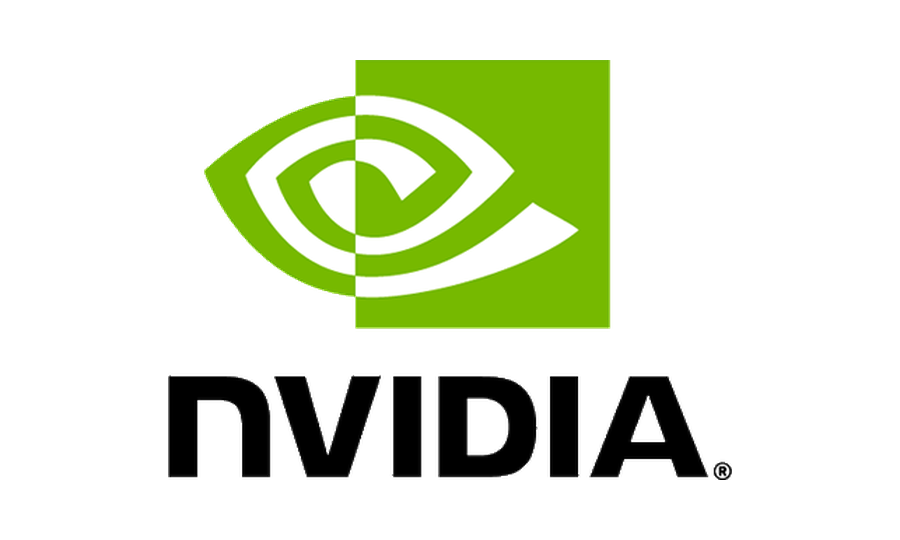
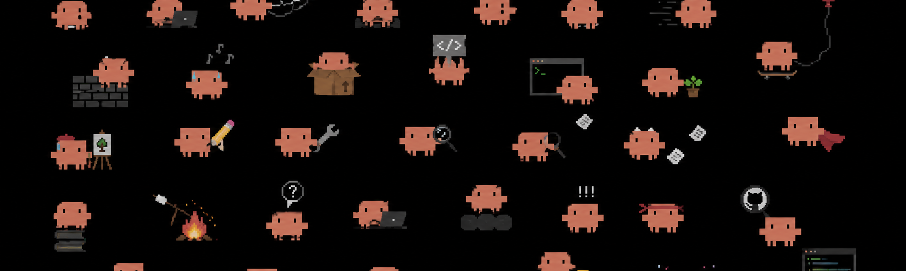

# claude-go-brr


[](https://github.com/Functio-AI/claude-go-brr/releases)
[](LICENSE.md)


Offload Claude Code workflows, deep-research, and parallel agent tasks to the cloud, and get results 2-3x faster.

- **2–3× faster** ultracode workflow execution ⚙️
- **2–3× faster** deep-research 🔬
- **2–3× faster** swarm of claude code instances 🐝


<p align="center">
  
  <br>
  <em>We can speed up ultracode workflows 2–3×.</em>
</p>

## Install

```text
/plugin marketplace add FunctioAI/claude-go-brr
/plugin install claude-go-brr@claude-go-brr
/reload-plugins
/claude-go-brr:setup
```

---

## Docs
- [Getting Started](docs/getting-started.md)
- [Architecture](docs/architecture.md)
- [Demos](docs/usage_examples.md)

---

<p align="left">
  <sub>Made by devs from</sub>
  <br><br>
  
  &nbsp;&nbsp;&nbsp;
  
  &nbsp;&nbsp;&nbsp;
  
  <br><br>
  Reach out to us! <a href="https://x.com/MakarKuznietsov">@MakarKuznietsov</a> 
</p>


