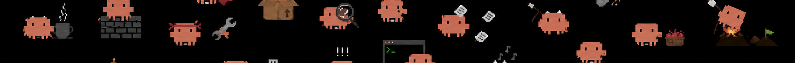
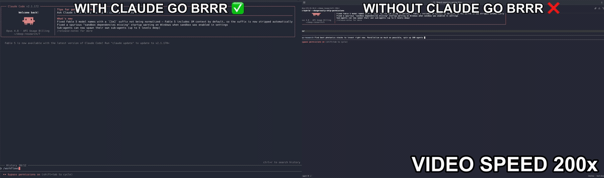
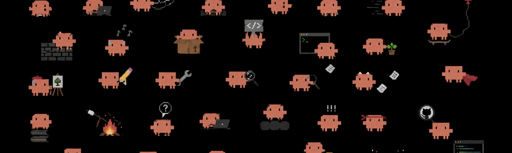

# claude-go-brr



[](https://github.com/FunctioAI/claude-go-brr/releases)
[](plugins/claude-go-brr/LICENSE.md)


Offload Claude Code workflows, deep-research, and parallel agent tasks to the cloud, and get results 2-3x faster.

- **2–3× faster** ultracode workflow execution ⚙️
- **2–3× faster** deep-research 🔬
- **2–3× faster** swarm of claude code instances 🐝

<p align="center">
  
  <br>
  <em>We can speed up ultracode workflows 2–3×.</em>
</p>


## Install

```text
/plugin marketplace add FunctioAI/claude-go-brr
/plugin install claude-go-brr@claude-go-brr
/reload-plugins
```


## Setup your inference


### Claude subscription

Run `claude setup-token` locally and sign in with your Claude Pro or Max account, then copy the generated token. Run `/claude-go-brr:env` from your project, open the settings URL it prints, and add the token as `CLAUDE_CODE_OAUTH_TOKEN` to authenticate subsequent workers with your Claude account.

### Claude API

Create an API key in the [Claude Console](https://console.anthropic.com/settings/keys), then run `/claude-go-brr:env`, open the printed settings URL, and add it as `ANTHROPIC_API_KEY` to use separately billed API credits. Set only one credential: Claude Code gives `ANTHROPIC_API_KEY` precedence when both are present. Values are stored securely, never printed by the command, and injected into subsequent workers for that project.

For controlled benchmarks, the CLI can attest an exact allowlist of non-secret
runtime settings without retrieving any stored values. For example:

```bash
plugins/claude-go-brr/offload.sh env -d /path/to/project \
  --expect CLAUDE_BRR_MODEL=claude-sonnet-5 \
  --expect CLAUDE_BRR_MAX_BUDGET_USD=0.30 \
  --expect CLAUDE_BRR_TOOLS=Bash
```

The command returns only checked, missing, and mismatched key names. Credential,
base-URL, and arbitrary environment keys are rejected locally and by the host.

## Polling controls

While waiting for a run, successful status checks repeat every second. Transient
network failures, plus rate-limit and server failures without `Retry-After`, use
a separate exponential retry delay based at five seconds and capped at 30
seconds. Advanced users can override these with `OFFLOAD_POLL_INTERVAL` (0.1–60
seconds), `OFFLOAD_RETRY_BACKOFF_BASE` (0.1–30 seconds), and
`OFFLOAD_POLL_TIMEOUT` (an integer up to 31,536,000 seconds). Invalid or
out-of-range values are rejected before a run is submitted.

---


## Docs

- [Getting Started](docs/getting-started.md)
- [Architecture](docs/architecture.md)

---
           
  
Reach out to us! [@MakarKuznietsov](https://x.com/MakarKuznietsov)


